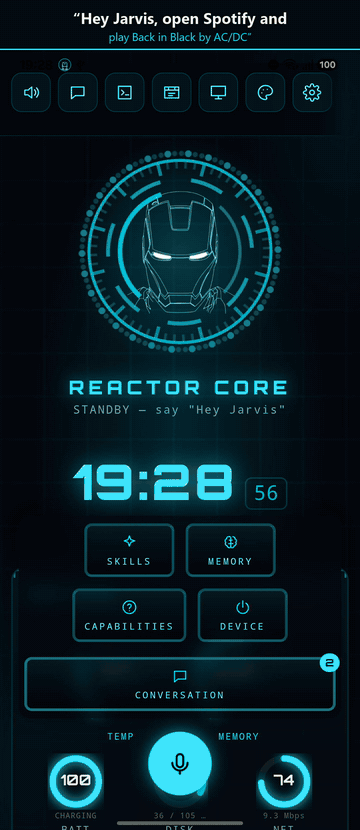
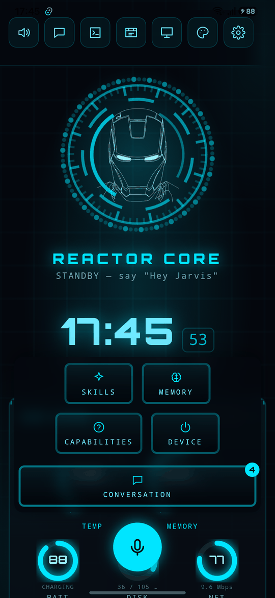

# JARVIS for Android

<p align="center">
  
  <br>
  <sub>One voice command, no taps: JARVIS opens Spotify, searches and plays the song. Slow parts sped up; the Spotify home screen is blurred.</sub>
</p>

A voice assistant that runs on your phone. It chats, does real tasks over the internet
(weather, news, search, places, reminders), **drives other apps on the phone by itself**,
and can **remote-control your Windows PC**.

It started as the Android port of a Windows desktop assistant. On Windows the "brain" is
a Python program the app talks to; here it is rewritten in TypeScript and runs **inside
the app**, so the phone needs no server and no Python.

> **Status: experimental.** This is a personal project under active development. It
> works on the phone it's developed on, but expect rough edges, and read
> [docs/SECURITY.md](docs/SECURITY.md) before giving it control of yours.

| | |
|---|---|
| **What it is** | Tauri 2 (Rust shell) + React HUD + a TypeScript brain + a Kotlin Android plugin |
| **App id / version** | `com.jarvis.app` / 0.1.0 |
| **State** | Experimental. Debug APK runs on a real phone (Samsung, Android 16); unit tests green in CI. What is live-verified vs only built is tracked in [docs/STATUS.md](docs/STATUS.md) |
| **Docs** | [Architecture](docs/ARCHITECTURE.md) · [Status](docs/STATUS.md) · [Security](docs/SECURITY.md) |

---

## What it can do today



- **Chat + tools** — LLM chat with weather, news, web search, places/directions,
  reminders, alarms/timers, calendar, QR codes, image generation, clipboard and file
  reading.
- **Providers** — Vertex AI (paste a Service Account JSON, runs on GCP credits), Google
  Gemini, or Groq, plus optional free OpenRouter / NVIDIA / Mistral keys. Pick provider
  and model in Settings, or let Auto mode choose: **smart routing** ranks every model your
  keys reach by benchmark score and sends each request to the weakest one that can handle
  it. When a free tier runs out the app walks that **route ladder** to the next key/model
  instead of giving up — per-minute limits are waited out, not treated as a day's ban.
- **Memory** — facts about you, playbooks and saved chats in one view (dock ▸ MEMORY or
  "open memory"), with a timeline and exact forget.
- **Voice** — push-to-talk mic, spoken replies, and on-device **"Hey Jarvis"** wake word
  ([openWakeWord](https://github.com/dscripka/openWakeWord)) running as an Android
  foreground service, so it keeps listening with the app in the background. Speech is
  transcribed by Groq Whisper (or Vertex Chirp); recording stops when you stop talking.
- **Phone control** — an AccessibilityService operator drives other apps step by step
  (read the screen → decide one action → do it → repeat), with a planner and a verifier.
  The loop runs natively in Kotlin, so a task keeps going after JARVIS leaves the screen.
  A floating **STOP** button works from any app.
- **Remote PC** — pair to the Windows desktop app by scanning a QR code, then forward
  whole tasks to it, watch its screen live over WebRTC, and drive it by touch. Works on
  the same Wi-Fi or across networks via Tailscale. (The desktop app is a separate project
  and is not part of this repository.)

Known gaps and the things that still need a live on-device test are tracked in
[docs/STATUS.md](docs/STATUS.md).

---

## Install

The quickest way to try it: download **`jarvis-release.apk`** from the
[latest release](https://github.com/AnaaySampat/jarvis/releases/latest), open it on your
phone and allow installing from that source. It's for 64-bit ARM phones (every modern
Android phone), Android 7.0 or newer. Then follow [First run](#5-first-run) below.

The release also has a debug APK. It's much bigger and only useful if you want to inspect
the app with developer tools.

> Early builds are signed with a development key. A later build signed with the final
> key may need you to uninstall this one first, which clears the app's data.

## Build the APK yourself

The steps below are for Windows (what the app is developed on); macOS/Linux work the same
way with their own paths.

### 1. Install the tools (once)

| Tool | Version this repo is built with | Notes |
|---|---|---|
| [Node.js](https://nodejs.org/) | 24 LTS | CI uses 24 |
| [Rust](https://rustup.rs/) | stable (1.95) | plus the Android targets below |
| JDK | 17 | Android Studio's bundled JBR works |
| [Android Studio](https://developer.android.com/studio) | any recent | only used for its SDK Manager |
| Android SDK Platform | 36 (and 34) | SDK Manager ▸ SDK Platforms |
| Android NDK | 27.x | SDK Manager ▸ SDK Tools ▸ NDK (Side by side) |
| SDK Build-Tools, Platform-Tools, Command-line Tools | latest | SDK Manager ▸ SDK Tools |

Add the Rust targets:

```bash
rustup target add aarch64-linux-android armv7-linux-androideabi i686-linux-android x86_64-linux-android
```

Set three environment variables (PowerShell, then open a **new** terminal — adjust the
NDK folder to the version you installed):

```powershell
[Environment]::SetEnvironmentVariable("JAVA_HOME", "C:\Program Files\Android\Android Studio\jbr", "User")
[Environment]::SetEnvironmentVariable("ANDROID_HOME", "$env:LOCALAPPDATA\Android\Sdk", "User")
[Environment]::SetEnvironmentVariable("NDK_HOME", "$env:LOCALAPPDATA\Android\Sdk\ndk\27.2.12479018", "User")
```

Put `%ANDROID_HOME%\platform-tools` on your `PATH` so `adb` works. The
[Tauri prerequisites page](https://v2.tauri.app/start/prerequisites/) has the same steps
with screenshots.

### 2. Get the code and install dependencies

```bash
git clone https://github.com/AnaaySampat/jarvis.git
```

```bash
cd jarvis/jarvis-studio-gui
```

```bash
npm install
```

All later commands run from `jarvis-studio-gui/`. Optional sanity check (no Android tools
needed): `npm run typecheck && npm run lint && npm test`.

Do **not** run `tauri android init` — the Android project in `src-tauri/gen/android` is
committed on purpose (it carries `allowBackup="false"`, the release cleartext rule and the signing config) and `init` would overwrite it.

### 3. Build

**Debug APK** — quickest, fine for trying it out:

```bash
npx tauri android build --debug --apk --target aarch64
```

Output: `src-tauri/gen/android/app/build/outputs/apk/universal/debug/app-universal-debug.apk`

**Release APK** — smaller and faster. Without a keystore it is signed with the debug key,
which is fine for sideloading onto your own phone:

```bash
npx tauri android build --apk --target aarch64
```

Output: `src-tauri/gen/android/app/build/outputs/apk/universal/release/app-universal-release.apk`

`--target aarch64` builds for 64-bit ARM, which is every modern phone. Leave it off to
build all four ABIs (a much bigger APK); use `--target x86_64` for the emulator. The first
build downloads Gradle and compiles all the Rust, so expect it to take a while.

**Signing a release with your own key** (needed if you publish APKs, so updates install
over each other):

```bash
keytool -genkey -v -keystore src-tauri/gen/android/app/jarvis-release.jks -keyalg RSA -keysize 2048 -validity 10000 -alias jarvis
```

Then copy `src-tauri/gen/android/keystore.properties.example` to `keystore.properties`
in the same folder and fill in the password. The `.jks` path is relative to
`gen/android/app/`. Both files are gitignored — never commit them, and back the keystore
up: losing it means users can't update to your future builds.

### 4. Install on your phone

On the phone: Settings ▸ About phone ▸ tap *Build number* 7 times, then turn on
Developer options ▸ **USB debugging** and plug it in. Then:

```bash
adb install -r src-tauri/gen/android/app/build/outputs/apk/universal/debug/app-universal-debug.apk
```

```bash
adb shell am start -n com.jarvis.app/.MainActivity
```

(Use the `release/app-universal-release.apk` path for a release build.) You can also copy
the APK to the phone and open it there, after allowing installs from that source.

### 5. First run

1. Enter at least one key in the first-run screen — see [Keys and security](#keys-and-security).
2. Allow the microphone when asked (voice and "Hey Jarvis").
3. For phone control, turn on **JARVIS** under Settings ▸ Accessibility. On Android 13+
   a sideloaded app's accessibility switch is greyed out at first: open Settings ▸ Apps ▸
   JARVIS ▸ ⋮ ▸ **Allow restricted settings**, then turn it on.

### Good to know

- **`tauri android dev` hangs after building — don't use it.** Use `tauri android build`
  (it exits cleanly), then `adb install` + `adb shell am start`.
- **The emulator is boot-only.** It has no real microphone and its software GPU makes
  SystemUI freeze under load (not an app bug). Audio, wake word, app control and PC
  pairing all need a real phone.
- **Don't `adb shell am force-stop com.jarvis.app`.** Android then turns JARVIS's
  accessibility service off and every phone task fails until you re-enable it in
  Settings ▸ Accessibility. Restart with `adb install -r` or `am start` instead.
- **Browser preview:** `npm run dev` runs the HUD in a browser for layout and chat work.
  Native features (phone control, wake word, TTS) aren't there.
- `scripts/build-android.ps1` wraps the build commands above (`-Debug`, `-Target arm64`).

## Keys and security

JARVIS needs at least one free key — [Google AI Studio](https://aistudio.google.com/)
(Gemini) or [Groq](https://console.groq.com/) — entered in the app's Settings. OpenRouter,
NVIDIA and Mistral keys are optional extra fallbacks; a Vertex AI service-account JSON
works too. Keys are stored on the phone encrypted with an Android Keystore key, are only
sent to the provider they belong to, and there are none in this repository.

Giving an assistant control of your phone is a real trust decision. What the app does to
limit that, and what is still open, is in [docs/SECURITY.md](docs/SECURITY.md). If you
find a vulnerability, please report it privately through GitHub's *Report a
vulnerability* (Security tab) rather than in a public issue.

---

## Layout

```
jarvis/
├── README.md                    ← you are here
├── CLAUDE.md                    ← instructions for AI coding assistants
├── docs/
│   ├── ARCHITECTURE.md          ← how the app is put together
│   ├── STATUS.md                ← what works, what's open, how it was verified
│   ├── SECURITY.md              ← the security model, then the audit history
│   ├── images/                  ← README screenshots
│   └── archive/                 ← the original 2026-06 plan + build log (history)
├── jarvis-studio-gui/           ← the app
│   ├── src/                     ← React HUD
│   │   ├── brain/               ← the TypeScript brain (see src/brain/README.md)
│   │   ├── components/, hud/, hooks/
│   └── src-tauri/               ← Rust shell
│       └── tauri-plugin-phone/  ← the Kotlin↔Rust↔JS Android plugin
```

The TypeScript brain was ported from the Windows app's Python backend, which is not part
of this repository.

---

## License and credits

The code is [MIT](LICENSE).

- The **"Hey Jarvis" wake-word model** (`tauri-plugin-phone/android/src/main/assets/hey_jarvis.onnx`)
  comes from [openWakeWord](https://github.com/dscripka/openWakeWord), whose pre-trained
  models are licensed **CC BY-NC-SA 4.0** — non-commercial use only. The MIT license above
  does not cover it; replace it with your own model if you need something else.
- "J.A.R.V.I.S." and the Iron Man helmet are Marvel's. This is an unofficial fan project,
  not affiliated with or endorsed by Marvel or Disney.
